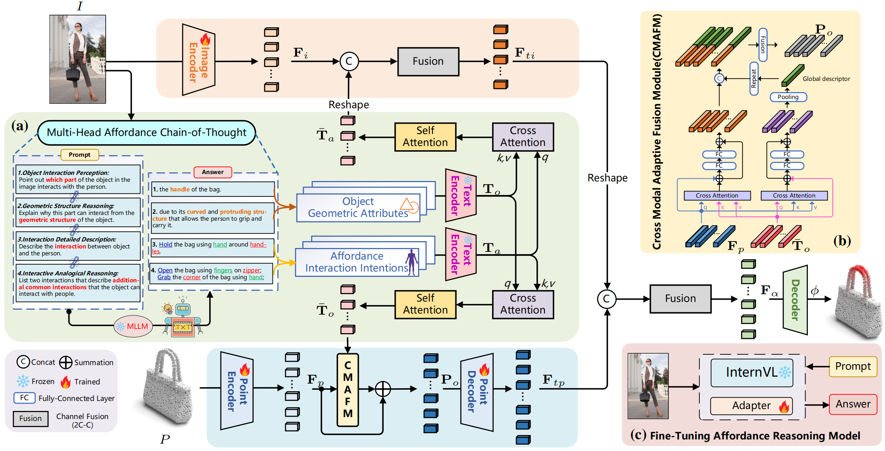

[](https://yawen-shao.github.io/GREAT/)
[](https://arxiv.org/abs/2411.19626)
# GREAT: Geometry-Intention Collaborative Inference for Open-Vocabulary 3D Object Affordance Grounding（CVPR 2025）
PyTorch implementation of GREAT: Geometry-Intention Collaborative Inference for Open-Vocabulary 3D Object Affordance Grounding. This repository contains PyTorch training, evaluation, inference code, pretrained models and PIADv2 dataset.

## ✅ TODO List

 - [x] Release paper on arxiv.
 - [x] Release the training, evaluation, and inference code.
 - [x] Release the pretrained checkpoint.
 - [x] Release PIADv2 dataset.

## 📋 Table of content
 1. [💡 Overview](#1)
 2. [📖 Dataset](#2)
 3. [✏️ Usage](#3)
    1. [Environment](#31)
    2. [Training](#32)
    3. [Evaluation](#33)
    4. [Render](#33)
    5. [Reasoning](#34)
 4.  [🔍 Citation](#4)

## 💡Overview <a name="1"></a> 
<p align="center">
     <br />
    <em> 
    </em>
</p>

## 📖 Dataset <a name="2"></a> 
<p align="center">
     <br />
    <em> 
    </em>
</p>

**Properties of the PIADv2 dataset.** **(a)** Extensive data examples from PIADv2, the red region in point clouds is the affordance annotation. **(b)** Category distribution in PIADv2. **(c)** Confusion matrix between affordance and object categories, where the horizontal axis represents object category and the vertical axis represents affordance category.**(d)** Ratio of images and point clouds in each affordance category.

Download the PIADv2 dataset from [Google Drive](https://drive.google.com/drive/folders/1n_L_mSmVpAM-1ASoW2T2MltYkaiA_X9X?usp=drive_link) or [Baidu Pan](https://pan.baidu.com/s/18w8kM78er2lwJc0JMWMvBg?pwd=PIAD) (key: PIAD). 

## ✏️ Usage <a name="3"></a> 
### Environment <a name="31"></a> 
First clone this respository and create a conda environment, as follows:
```bash  
git clone https://github.com/yawen-shao/GREAT_code.git
cd GREAT_code
conda create -n great python=3.9 -y
```
Then, install the other dependancies:
```
pip install -r requirements.txt
```

### Training <a name="32"></a> 
To train the GREAT model, you can modify the training parameter in `config/config_seen_GREAT.yaml` and then run the following command:
```bash  
bash train.sh
```

### Evaluation <a name="33"></a> 
To evaluate the trained GREAT model, run the following command:
```bash  
bash evalization.sh
```
### Render <a name="34"></a> 
Refer to [IAG-Net](https://github.com/yyvhang/IAGNet/blob/master/rend_point.py) for the object visualization. 

### Reasoning <a name="35"></a> 
If you want to define your own prompts to reason about object/affordance knowledge, you can refer to the `model/MHACoT.py`.<br> 
For specific reasoning implementations and how to finetune your own affordance model, refer to [InternVL](https://huggingface.co/OpenGVLab/InternVL2-4B).

## 🔍 Citation <a name="4"></a> 

```
@article{GREAT_Shao,
  title={GREAT: Geometry-Intention Collaborative Inference for Open-Vocabulary 3D Object Affordance Grounding},
  author={Shao, Yawen and Zhai, Wei and Yang, Yuhang and Luo, Hongchen and Cao, Yang and Zha, Zheng-Jun},
  journal={arXiv preprint arXiv:2411.19626},
  year={2024}
}
```

## Acknowledgement
The code is built based on [IAGNet](https://github.com/yyvhang/IAGNet). Thanks for the excellent open-source code!!